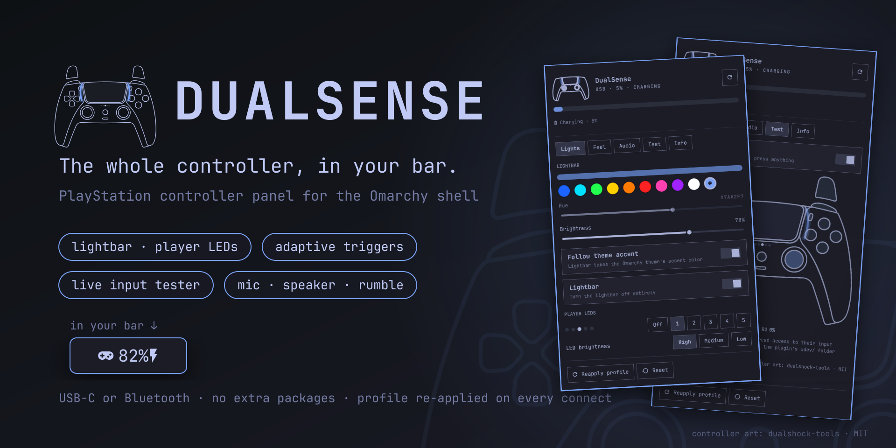

# DualSense — Omarchy bar widget

Your PlayStation DualSense (and DualSense Edge) at a glance in the Omarchy
Quattro bar, plus a floating panel that controls everything the controller
can do on Linux: lightbar, player LEDs, adaptive triggers, rumble, the
built-in microphone and speaker, a live input tester and the hardware details.
Works over USB-C and Bluetooth, alongside the kernel's `hid_playstation`
driver, with no extra packages.



- Gamepad glyph with the battery level beside it and a bolt while charging.
  Dimmed when no controller is connected; urgent color when the battery is
  low and not charging.
- Clicking opens a floating panel — the same popout style as the network and
  power widgets — with the battery bar, a DualSense drawing that shows the
  real lightbar color and player LEDs, and five tabs:
  - **Lights**: lightbar color from swatches, a hue slider or the theme accent
    (the bar follows every theme change), brightness, lightbar on/off; player
    LED pattern (off, 1–5) and LED brightness.
  - **Feel**: adaptive trigger effects for L2/R2 — off, resistance, weapon,
    bow, galloping, machine, vibration — with a strength slider, linked or per
    trigger; rumble and trigger motor strength; a rumble test through the same
    force-feedback path games use.
  - **Audio**: mute the built-in microphone, the mute LED (auto/off/on/pulse),
    mic gain, headphone/speaker routing and volume.
  - **Test**: live input drawn on the controller — every button lights, the
    sticks move, triggers fill, touches show on the touchpad, gyro and
    accelerometer read out below.
  - **Info**: model, connection, address, firmware build, hardware revision,
    kernel driver and device nodes, with permission problems called out, and
    the plugin version (worth including in a bug report).
- Everything you pick is saved to a profile and re-applied automatically when
  a controller connects (the kernel resets the lightbar on every connection).
- Desktop notifications (via the Omarchy shell) for: controller connected /
  disconnected, battery low, fully charged.
- Power off / disconnect buttons when the controller is on Bluetooth.
- Several controllers: a picker chooses which one the panel shows (battery,
  tester, details). Lightbar, LED, trigger and audio settings are one profile
  applied to every controller.
- Hot-plug aware (udev): a controller shows up the moment it connects. While
  one is connected the widget polls every 5 s (2 s with the panel open); with
  none it checks once a minute.

## Interactions

| Action | Result |
|---|---|
| Left / right click | Toggles the floating panel |
| Middle click | Refreshes now |
| Esc (panel open) | Closes the panel |

IPC:

```bash
omarchy-shell atoslins.dualsense open|close|toggle|refresh
omarchy-shell atoslins.dualsense lightbar '#ff4000'   # also: brightness 60, followTheme true
omarchy-shell atoslins.dualsense player 2            # 0 (off) to 5
omarchy-shell atoslins.dualsense trigger weapon      # off|feedback|weapon|bow|galloping|machine|vibration
omarchy-shell atoslins.dualsense mic off             # mute · `mic on` unmutes
omarchy-shell atoslins.dualsense rumble              # half-second test
omarchy-shell atoslins.dualsense apply               # re-apply the saved profile
omarchy-shell atoslins.dualsense poweroff            # Bluetooth only
omarchy-shell atoslins.dualsense tab test            # lights|feel|audio|test|info
```

## Install

```bash
omarchy plugin add https://github.com/atoslins/omarchy-plugin-dualsense
omarchy plugin enable atoslins.dualsense
```

It lands in the right section of the bar; move it where you like:
`omarchy bar move atoslins.dualsense --section right --index 3`.

## Update

```bash
omarchy plugin update atoslins.dualsense
omarchy restart shell
```

The update shows the diff before applying it, and
[CHANGELOG.md](CHANGELOG.md) — also on the
[releases page](https://github.com/atoslins/omarchy-plugin-dualsense/releases) —
says what changed. Restart the shell afterwards: it keeps the panel code it
already loaded until then.

Every version is tagged. To go back to one, check out its tag and restart the
shell; the next `omarchy plugin update` brings you to the latest again:

```bash
git -C ~/.config/omarchy/plugins/atoslins.dualsense checkout v1.0.3
```

## Remove

```bash
omarchy plugin remove atoslins.dualsense
```

The profile in `~/.config/dualsense/` stays; delete it if you want.

## Permissions

The plugin writes to the controller's hidraw node. Steam's `steam-devices`
package already grants that to the logged-in user, so if Steam is installed
you are done. Otherwise install the rule shipped in `udev/` with the verifier
that sits next to it:

```bash
sudo ~/.config/omarchy/plugins/atoslins.dualsense/udev/install-udev-rule
```

then reconnect the controller. The same rule also opens the motion-sensor and
touchpad input nodes, which the **Test** tab needs for gyro, accelerometer and
touches (the gamepad itself works without it). The panel tells you when
access is missing.

The verifier exists because a plain `sudo cp` would copy whatever is in your
home directory at the moment the privileged copy runs, and a udev rule is
system policy. `install-udev-rule` (Python 3, standard library) pins the
SHA-256 of the reviewed rule, opens the source without following symlinks,
checks that the descriptor is a regular, single-link, non-world-writable file
owned by root or by you, hashes the bytes it actually read, writes those bytes
to a root-owned staging file created with `O_EXCL` in `/etc/udev/rules.d`,
verifies the staged copy, renames it atomically, verifies the installed file
again, and only then reloads udev. Any mismatch aborts, removes what it
staged, and installs nothing. `install-udev-rule check` reports the state
without root; `sudo install-udev-rule remove` takes the rule out, refusing to
delete a file that is not the reviewed one unless you pass `--force`.

## Bluetooth

Hold **Create** + **PS** until the lightbar blinks fast, then pick "Wireless
Controller" in the Bluetooth menu. Once paired it reconnects with the PS
button. The battery, lightbar, LEDs, triggers, audio and power-off all work
over Bluetooth; USB and Bluetooth report the battery in 10% steps (5, 15, …,
95, 100), which is what the controller sends.

## Troubleshooting

**The controller looks on but the widget says nothing is connected.** Over
Bluetooth the input session can drop while the link itself stays up — the
controller keeps its lights, but the kernel has no device left, so nothing can
read the battery or set the lightbar. The panel detects this and offers
**Reconnect** (`dualsense-ctl reconnect`, or
`omarchy-shell atoslins.dualsense reconnect`), which only ever tries to connect:
a DualSense powers itself off the instant the host drops its link, so
disconnecting first would turn a recoverable state into a controller that is
simply off. When connecting does not take, the PS button is the only way back.

**It keeps dropping every few minutes.** Look for this in `journalctl -u bluetooth`:

```
bluetoothd: profiles/input/device.c:hidp_send_message() BT socket write error:
Resource temporarily unavailable (11)
```

That is the L2CAP send buffer filling up, and BlueZ tears the HID session down
when it happens. A connected DualSense streams ~220 input reports a second, so
the link has little headroom, and combo Wi-Fi/Bluetooth chips (MediaTek MT7921,
some Intel and Realtek parts) share a radio between both. The usual fix is to
turn off L2CAP retransmission mode, which is what keeps the buffer blocked:

```bash
echo 'options bluetooth disable_ertm=1' | sudo tee /etc/modprobe.d/bluetooth-ertm.conf
sudo sh -c 'echo 1 > /sys/module/bluetooth/parameters/disable_ertm'   # until reboot
```

Reconnect the controller afterwards; the setting applies to new links. The USB-C
cable is unaffected by all of this.

**The lightbar keeps its startup color.** The controller runs its own lightbar
animation after connecting and ignores requested colors until it is handed
control explicitly. Every command here that touches the lightbar sends that
handover first, so this should not happen; if it does, **Reapply profile**
forces it.

## Games

The kernel driver exposes a standard gamepad, so SDL-based games and Steam
Input see the DualSense right away. Steam handles rumble, the lightbar and
adaptive triggers itself while a game runs and hands the controller back when
it exits; the plugin re-applies your profile on the next connection or with
**Reapply profile**.

## Settings

Set them with `omarchy bar set`:

```bash
omarchy bar set atoslins.dualsense lowBattery 15
omarchy bar set atoslins.dualsense hideWhenDisconnected true
```

or in the widget's entry in `~/.config/omarchy/shell.json`. Switches take
`true`/`false` (also `on`/`off`, `yes`/`no`, `1`/`0`); numbers out of range
are clamped.

- `pollSeconds` (default `5`, 1–3600) — polling interval while a controller is
  connected and the panel is closed.
- `notifications` (default `true`) — desktop notifications.
- `lowBattery` (default `20`, 0–100) — percentage that counts as low.
- `applyOnConnect` (default `true`) — re-apply the profile when a controller
  connects (and at shell start).
- `profileFile` (default `~/.config/dualsense/profile.json`) — where the
  profile lives.
- `showPercent` (default `true`) — battery percentage in the bar.
- `hideWhenDisconnected` (default `false`) — collapse the widget when no
  controller is connected instead of dimming it.

Example:

```json
{ "id": "atoslins.dualsense", "lowBattery": 15, "hideWhenDisconnected": true }
```

## Command line

`bin/dualsense-ctl` is a standalone tool (Python 3, standard library only)
that the panel drives; it is handy on its own:

```bash
ln -s ~/.config/omarchy/plugins/atoslins.dualsense/bin/dualsense-ctl ~/.local/bin/

dualsense-ctl status --pretty              # JSON snapshot of every controller
dualsense-ctl info                          # human readable details
dualsense-ctl lightbar '#ff4000' -b 80      # color + brightness; also: lightbar off|on
dualsense-ctl player 3 [--fade]             # 0–5 (6 outer pair, 7 inner three)
dualsense-ctl led-brightness low
dualsense-ctl trigger both weapon -s 6      # left|right|both · effects above
dualsense-ctl rumble --strong 80 --weak 40 --ms 500
dualsense-ctl mic off --led                 # mute + light the mute LED
dualsense-ctl speaker internal && dualsense-ctl volume 60
dualsense-ctl attenuation 2 0               # weaker rumble, full triggers
dualsense-ctl monitor                       # live input as JSON lines
dualsense-ctl profile set lightbar.color '#00ff88'
dualsense-ctl apply                         # re-apply the profile
dualsense-ctl reconnect                     # rebuild a stale Bluetooth link
dualsense-ctl poweroff                      # Bluetooth only
```

Add `--device MAC` to pick a controller, `--all` for every one.

## Requirements

- Omarchy 4 (Quattro) shell.
- Linux `hid_playstation` driver (kernel 5.12+, built into Omarchy).
- `python3` (already required by Omarchy), `udevadm` (systemd).
- Read/write access to the controller's hidraw node — see **Permissions**
  (`udev/install-udev-rule` installs the bundled rule with digest verification).
- Optional: `bluetoothctl` for the disconnect button.

## Credits

- Controller line art by [dualshock-tools](https://github.com/dualshock-tools/dualshock-tools.github.io)
  (© 2024 the_al, MIT), converted to QtQuick Shapes so it takes the theme
  colors — see [THIRD_PARTY_NOTICES.md](THIRD_PARTY_NOTICES.md).
- HID report layout documented by [dualsensectl](https://github.com/nowrep/dualsensectl)
  and the Linux `hid-playstation` driver.

## License

MIT — see [LICENSE](LICENSE).
